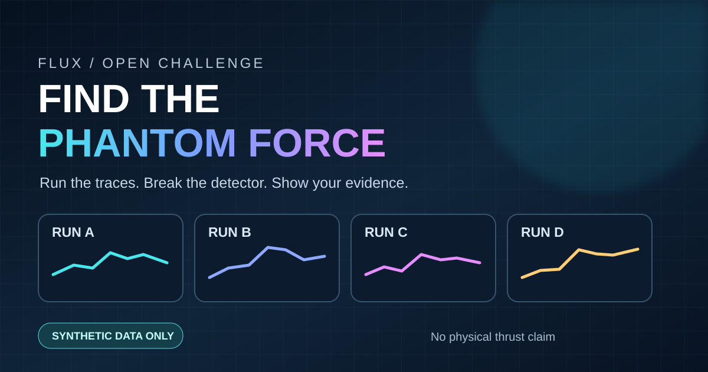

# Aurora / Flux Drive — independent review

**Civic Continuum | Public non-confidential research summary**

We invite physicists, metrologists, controls engineers, and laboratory safety reviewers to challenge our proposed evidence standard. We welcome a correction, a null result, or a clear stop criterion.

## Current status

The current work is software simulation and measurement planning. A local submission demonstration passed 121 software tests with hardware input/output disabled. Those tests do not establish a physical emergency stop, calibrated force measurement, anomalous force, or propulsion. No reactionless propulsion, faster-than-light travel, spacetime control, or flight-capable vehicle has been demonstrated. `physical_propulsion_proven=false`.

The proposed physical readiness work remains blocked on independently calibrated measurement channels, environmental and sham controls, uncertainty values, a physically tested emergency disconnect, and independent operation. No hazardous hardware work is authorized by this page.

## Public synthetic challenge

The [fictional force-trace challenge](sandbox/README.md) lets reviewers test simple artifact subtraction and submit counterexamples. Its arbitrary data and generic columns are educational only; they reveal no article geometry, operating settings, or physical measurements.

This is **free participation with no prize, cash award, raffle, funding offer, employment offer, or promise to use an idea**. It is an educational exercise, not a competition to make a physical engine fly. Public issue submissions are screened by a maintainer before appearing on the [opt-in contribution board](https://github.com/mommommy1960-lang/flux-drive-public-review/issues/2). Only independently reproduced synthetic critiques can receive the validated label. Review status is not certification, endorsement by a laboratory or institution, or evidence of a working device. Public entries are **not** automatically ingested, executed, or merged into the private research sandbox.

Please read the [versioned review standard](REVIEW_STANDARD.md), [participation and credit terms](CONTRIBUTING.md), [community conduct](CODE_OF_CONDUCT.md), [security instructions](SECURITY.md), and the [scope-limited license for four sandbox files](LICENSE-SANDBOX.md). GitHub issues are public and may persist in notifications, forks, or archives even if removed. Do not post unpublished inventions, real measurements, build instructions, credentials, personal data, third-party content without permission, or unsafe instructions.

## Review questions

1. Which assumptions or dimensional, momentum, and energy accounts fail physical scrutiny?
2. What ordinary thermal, cable, magnetic, acoustic, vibration, tilt, or environmental effects could mimic an apparent force?
3. What minimum blinded and calibrated controls would make a low-energy result interpretable? What finding would falsify the claim?
4. Which software safety and replay assertions can be assessed independently, and which require physical evidence?
5. What stop criterion should govern any move from software to a physical bench?

Please provide a specific critique and identify the evidence needed to resolve it. We do not run code or open executable attachments supplied by strangers. A deeper technical review requires identified reviewers, a defined scope, and appropriate disclosure terms.

## Disclosure boundary

This public page deliberately contains no materials list, geometry, sensor layout, calibration procedure, operating sequence, device-specific channel schema, physical control code, parameter search, raw data, or patent mapping. The public sandbox license covers only its expressly listed educational files; review of this summary grants no physical implementation, patent, or commercial apparatus rights.
